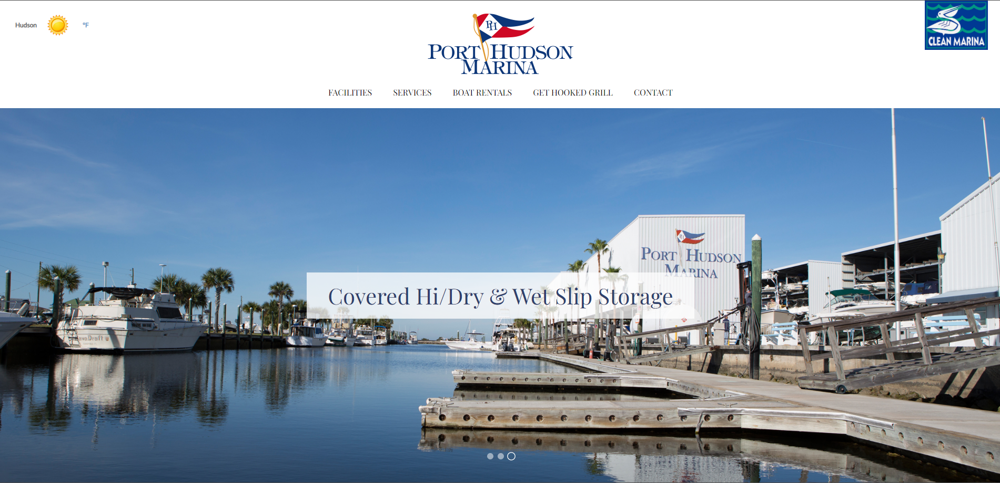
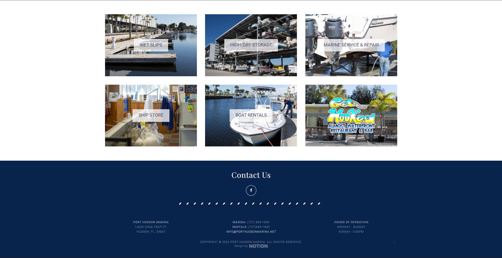

## Table of contents

- [Overview](#overview)
  - [The Project](#the-project)
  - [Screenshot](#screenshot)
  - [Links](#links)
- [My process](#my-process)
  - [Built with](#built-with)
  - [What I learned](#what-i-learned)
- [Author](#author)

## Overview

### The Project

A code test for a job 
All I had to do is duplicate their landing page the closest possible to get the job.

### Screenshot 

### My version 👋 👋

### Links

- [The Job Website URL](https://www.porthudsonmarina.net/)

- [My Version](https://porthudsonmarina.netlify.app/)

## My process

### Built with 🚀

- Semantic HTML5 markup
- CSS custom properties
- Flexbox
- Desktop-first workflow
- Vanilla JavaScript

### What I learned 🚀

Building this project, I have been able to work on my frontend development skills which includes:

- Responsive web design
- CSS custom properties
- Javascript addEventListener
- Stackoverflow.com is a goldmine

the project has also gave me a chance to try out a new library I just learnt [AOS](https://github.com/michalsnik/aos)

## Author 🚀

- Github - [Darwin Andre](https://github.com/basquii)
- LinkedIn - [Darwin Basqui Andre](https://www.linkedin.com/in/basqui)
- Portfolio -[Hire Me](https://basquidesign.com)
